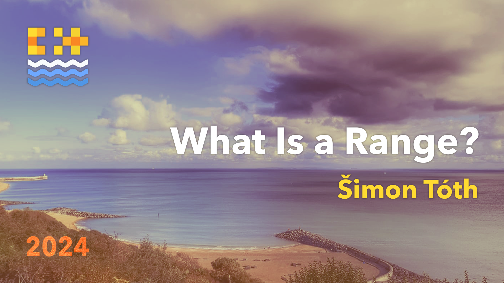

# What is a Range?

* 

## Books

### A Complete Guide to Standard C++ Algorithms

* [Grab the free version](https://github.com/HappyCerberus/book-cpp-algorithms)
* [Get it on Leanpub](https://leanpub.com/cpp-algorithms-guide)

### Surviving the C++ Coding Interview

* [Grab the community edition](https://leanpub.com/cpp-coding-interview/signup)
* [Grab the EFF edition](https://leanpub.com/cpp-coding-interview)

## Daily bit(e) of C++

* Best experience on [LinkedIn](https://www.linkedin.com/in/simontoth)
* [Mastodon](https://hachyderm.io/@simontoth)
* RSS or Email on [Medium](https://medium.com/@simontoth)
* RSS or Email on [Substack](https://simontoth.substack.com)
* [Archive](https://github.com/HappyCerberus/daily-bite-cpp)